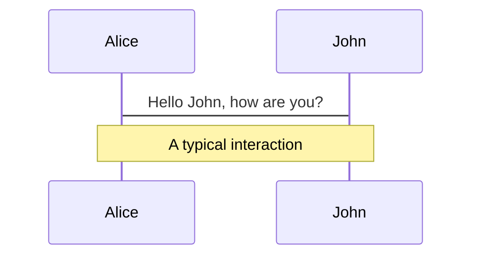
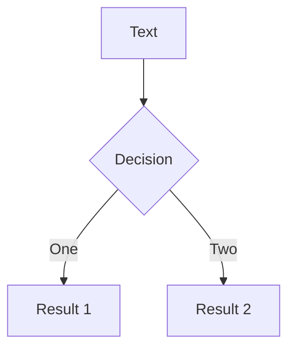
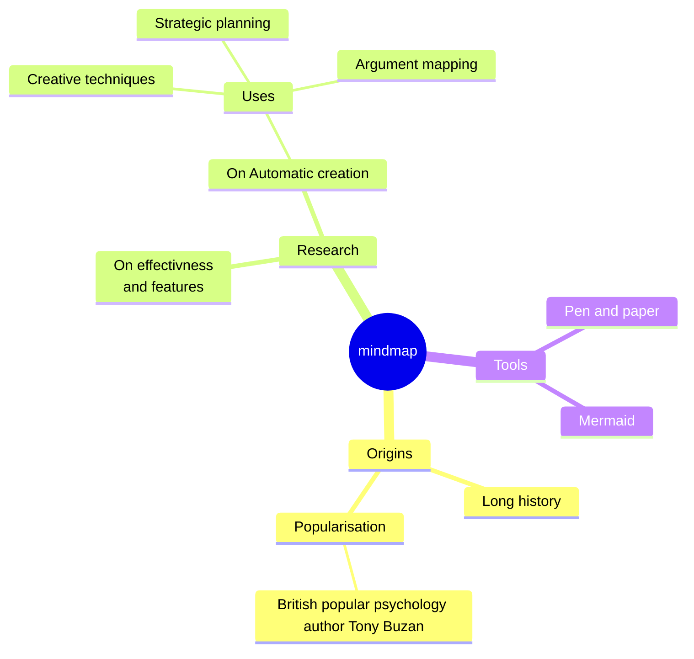
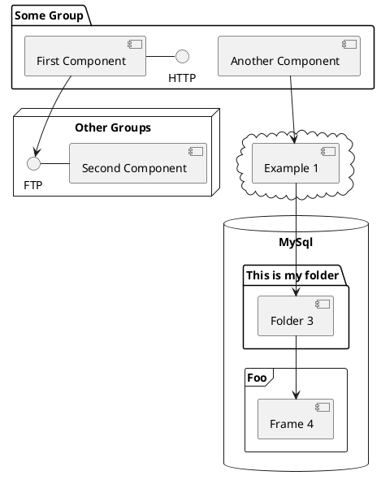

# Porównanie wydajności silników JavaScript
  <div>
    Dyplomant: inż. Filip Rutkowski
  </div>
  <div>
    Promotor: dr. inż Tomasz Grześ
  </div>
  <div class="pt-12">
    <span @click="$slidev.nav.next" class="px-2 py-1 rounded cursor-pointer" hover="bg-white bg-opacity-10">
      Press Space for next page <carbon:arrow-right class="inline"/>
    </span>
  </div>

  <div class="abs-br m-6 flex gap-2">
    <button @click="$slidev.nav.openInEditor()" title="Open in Editor" class="text-xl slidev-icon-btn opacity-50 !border-none !hover:text-white">
      <carbon:edit />
    </button>
    <a href="https://github.com/slidevjs/slidev" target="_blank" alt="GitHub" title="Open in GitHub"
      class="text-xl slidev-icon-btn opacity-50 !border-none !hover:text-white">
      <carbon-logo-github />
    </a>
  </div>

<!--
The last comment block of each slide will be treated as slide notes. It will be visible and editable in Presenter Mode along with the slide. [Read more in the docs](https://sli.dev/guide/syntax.html#notes)
-->

---
transition: fade-out
---
<h1 class="text-purple">Co to jest JavaScript</h1>
<!-- # Co to jest JavaScript? -->

JavaScript jest językiem kompilowanym, który czasami jest mylony z językiem interpretowanym, gdyż kompiluje się za każdym razem, gdy jest wykonywany. 

Podstawowymi zaletami JS są jego:
<v-clicks>

- 🎨 **Wszechstronność** - Może być on używany zarówno po stronie klienta(w przeglądarkach internetowych) jak i po stronie serwera(Node.js)
- ⏳ **Asynchroniczność** - obsługa asynchroniczności za pomocą callbaków i obietnic(Promise) oraz async/await
- 🔀 **Dynamiczne typowanie danych** - jedna zmienna w przeciągu swojego życia może posiadać wartości różnych typów
- 🤹‍♂️ **Interakcja z DOM** - JavaScript umożliwia interakcję z modelem obiektowym dokumentu (DOM), co pozwala na dynamiczną modyfikację treści i struktury stron internetowych.
- 🧑‍💻 **Wsparcie dla programowania obiektowego** - JavaScript jest językiem programowania obiektowego, co umożliwia tworzenie bardziej zorganizowanego i modularnego kodu.

</v-clicks>


<br>
<br>


---
layout: default
---

<h1 class="text-purple">Przykładowy kod w JavaScript</h1> 

```js {all|1|1|1|2-3|2-3|2-3|5-9|6|1-12|14-15|17-21}
function generateRandomPassword(length) {
  const charset = "abcdefghijklmnopqrstuvwxyzABCDEFGHIJKLMNOPQRSTUVWXYZ0123456789";
  let password = "";

  for (let i = 0; i < length; i++) {
    var hello = 20
    const randomIndex = Math.floor(Math.random() * charset.length);
    password += charset[randomIndex];
  }

  return password;
}

const passwordLength = 12;
const randomPassword = generateRandomPassword(passwordLength);

console.log('2' === 2) // False
console.log('2' == 2) // True
console.log('' == false) // True
console.log('NoEmpty' == false) // False

```

<arrow v-click="[1, 2]" x1="280" y1="220" x2="110" y2="130" color="#564" width="3" arrowSize="1" />
<arrow v-click="[2, 3]" x1="400" y1="220" x2="230" y2="130" color="#564" width="3" arrowSize="1" />
<arrow v-click="[3, 4]" x1="500" y1="220" x2="330" y2="130" color="#564" width="3" arrowSize="1" />
<arrow v-click="[5, 6]" x1="280" y1="230" x2="110" y2="140" color="#564" width="3" arrowSize="1" />
<arrow v-click="[6, 7]" x1="265" y1="250" x2="95" y2="160" color="#564" width="3" arrowSize="1" />
<arrow v-click="[8, 9]" x1="280" y1="304" x2="110" y2="214" color="#564" width="3" arrowSize="1" />

<style>
.footnotes-sep {
  @apply mt-20 opacity-10;
}
.footnotes {
  @apply text-sm opacity-75;
}
.footnote-backref {
  display: none;
}
</style>

---
layout: image-right
image: https://images.unsplash.com/photo-1482745637430-91c0bbcea3e1?q=80&w=2070&auto=format&fit=crop&ixlib=rb-4.0.3&ixid=M3wxMjA3fDB8MHxwaG90by1wYWdlfHx8fGVufDB8fHx8fA%3D%3D
---

# Frameworki

JavaScript posiada także frameworki, które ułatwiają pisanie kodu w nim.

Najbardziej popularnymi są frameworki frontendowe Angular, Vue i React.


---
layout: image-right
image: https://plus.unsplash.com/premium_photo-1671439543718-9e4d009827e8?q=80&w=2113&auto=format&fit=crop&ixlib=rb-4.0.3&ixid=M3wxMjA3fDB8MHxwaG90by1wYWdlfHx8fGVufDB8fHx8fA%3D%3D
---

# Silniki
Silniki JavaScriptowe to programy komputerowe, które interpretują i wykonują kod napisany w języku JavaScript. Silniki JavaScriptowe są niezbędne do przetwarzania i wykonania tego kodu w środowisku przeglądarki internetowej.

---
layout: default
---
# Przykładowe silniki


Silniki jakie można wyróżnić to:
<v-clicks> 

<div>
<div class="flex pt-10">
 <div class="text-xs pt-1 pr-1">◼</div>
	
   <div class="">
      
   </div>  
   <div class="font-bold pr-2">
     V8
   </div>
   <div> - V8 to silnik JavaScript stworzony przez Google. Jest on używany w przeglądarkach internetowych  </div>
 </div> 

<div> opartych na Chromium, takich jak Google Chrome i Opera. V8 jest znany ze swojej szybkości wykonania kodu JavaScript dzięki technologiom takim jak kompilacja do natywnego kodu maszynowego.  </div>
</div>

<div>
<div class="flex pt-10">
 <div class="text-xs pt-1 pr-1">◼</div>
	
   <div class="">
      
   </div>  
   <div class="font-bold pr-2">
     SpiderMonkey  
   </div>
   <div> - Jest to silnik JavaScript używany w przeglądarkach Mozilla Firefox. SpiderMonkey jest   </div>
 </div> 

<div> jednym z najstarszych silników JavaScript i rozwijany jest przez Mozilla Foundation. Został on napisany w językach C++, Rust i JavaScript. </div>
</div>

<div>
<div class="flex pt-10">
 <div class="text-xs pt-1 pr-1">◼</div>
	
   <div class="">
      
   </div>  
   <div class="font-bold pr-2">
     JavaScriptCore  
   </div>
   <div> - Silnik ten jest używany w przeglądarkach Safari firmy Apple. Jest również znany jako </div>
 </div> 

<div> Nitro. JavaScriptCore jest częścią projektu WebKit, który obejmuje również renderowanie stron internetowych. </div>
</div>

</v-clicks>

<!-- <div grid="~ cols-2 gap-4">
<div>

You can use Vue components directly inside your slides.

We have provided a few built-in components like `<Tweet/>` and `<Youtube/>` that you can use directly. And adding your custom components is also super easy.

```html
<Counter :count="10" />
``` -->

<!-- ./components/Counter.vue -->
<!-- <Counter :count="10" m="t-4" />

Check out [the guides](https://sli.dev/builtin/components.html) for more.

</div>
<div>

```html
<Tweet id="1390115482657726468" />
```

<Tweet id="1390115482657726468" scale="0.65" />

</div>
</div> -->

<!--
Presenter note with **bold**, *italic*, and ~~striked~~ text.

Also, HTML elements are valid:
<div class="flex w-full">
  <span style="flex-grow: 1;">Left content</span>
  <span>Right content</span>
</div>
-->

---
layout: iframe-right
url: https://hermesengine.dev/
preload: false
transition: slide-up
---

# HermesEngine

Hermes to silnik JavaScript typu open source zoptymalizowany pod kątem React Native. W przypadku wielu aplikacji korzystanie z Hermes spowoduje skrócenie czasu uruchamiania, zmniejszenie zużycia pamięci i mniejszy rozmiar aplikacji w porównaniu z JavaScriptCore. Hermes jest domyślnie używany przez React Native i nie jest wymagana żadna dodatkowa konfiguracja, aby go włączyć.

---
layout: image
image: ./components/image-grayscale.png
---
<h1 class="text-white">Cel pracy</h1>
Temat pracy koncentruje się na analizie porównawczej wydajności czterech silników JavaScriptowych: SpiderMonkey, V8, JavaScript Core oraz HermesEngine. Badanie ma na celu ocenę wydajności nowego silnika, tj. HermesEngine, względem starszych rozwiązań. Analiza uwzględnia różne parametry wydajności, takie jak szybkość wykonywania operacji, optymalizacja zarządzania pamięcią oraz zgodność ze standardami. Pozwoli to na określenie, który silnik jest najlepszy w zależności od tych parametrów, co skutkuje tym, że programista będzie miał świadomość, na co powinien zwracać uwagę, gdy tworzy oprogramowanie dla różnych przeglądarek internetowych. Poza tym badanie uświadomi, jak wielkie możliwości ma nowy silnik, gdyż aktualnie nie jest on jeszcze popularnym rozwiązaniem.
---

# Diagrams

You can create diagrams / graphs from textual descriptions, directly in your Markdown.

<div class="grid grid-cols-4 gap-5 pt-4 -mb-6">









</div>

[Learn More](https://sli.dev/guide/syntax.html#diagrams)

---
src: ./pages/multiple-entries.md
hide: false
---

---
layout: center
class: text-center
---

# Learn More

[Documentations](https://sli.dev) · [GitHub](https://github.com/slidevjs/slidev) · [Showcases](https://sli.dev/showcases.html)
